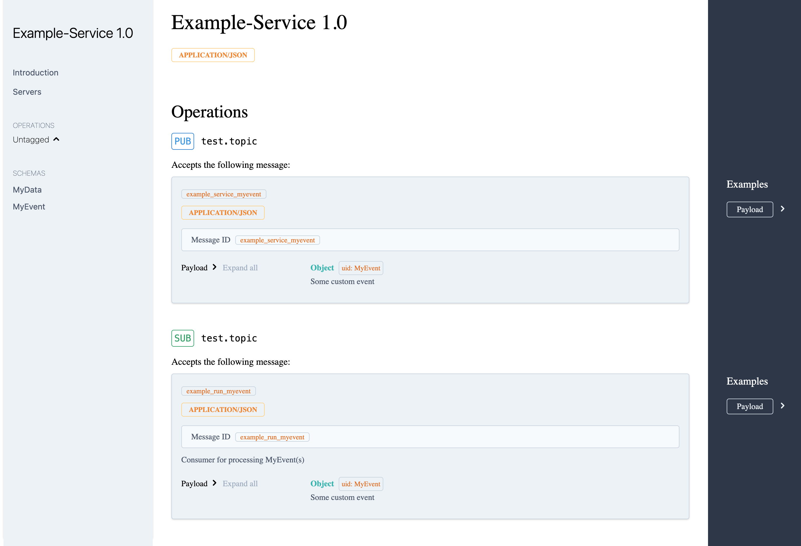

## Documentation generation

eventiq can automatically generate [Async API](https://www.asyncapi.com/) documentation of your service.

### Usage

```shell
eventiq generate-docs {package}.{module}:{service-instance} --format=yaml|json --out=output-path
```
Example:
```shell
eventiq generate-docs examples.asyncapi:service --format=yaml --out=./asyncapi.yaml
```

Result


```yaml
asyncapi: 2.5.0
channels:
  test.topic:
    publish:
      message:
        contentType: application/json
        description: ''
        messageId: example_service_myevent
        payload:
          $ref: '#/components/schemas/MyEvent'
        tags: []
    subscribe:
      message:
        contentType: application/json
        description: Consumer for processing MyEvent(s)
        messageId: example_run_myevent
        payload:
          $ref: '#/components/schemas/MyEvent'
        tags: []
components:
  schemas:
    MyData:
      description: Main data for service
      properties:
        counter:
          title: Counter
          type: integer
        info:
          title: Info
          type: string
      required:
      - counter
      - info
      title: MyData
      type: object
    MyEvent:
      description: Some custom event
      properties:
        data:
          $ref: '#/components/schemas/MyData'
        datacontenttype:
          default: application/json
          title: Datacontenttype
          type: string
        id:
          title: Id
          type: string
        source:
          title: Source
          type: string
        subject:
          title: Subject
          type: string
        time:
          format: date-time
          title: Time
          type: string
        traceid:
          title: Traceid
          type: string
        type:
          default: MyEvent
          title: Type
          type: string
        version:
          default: '1.0'
          title: Version
          type: string
      required:
      - subject
      - data
      title: MyEvent
      type: object
defaultContentType: application/json
info:
  title: Example-Service
  version: '1.0'
servers: {}
```

## Preview

